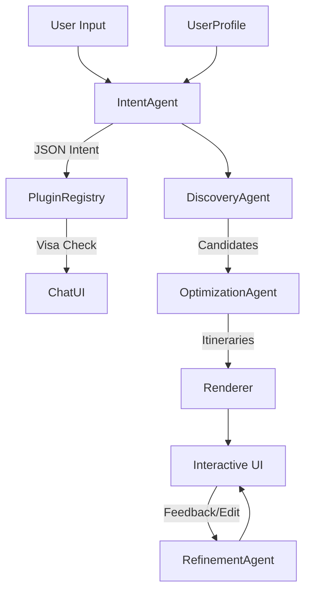

# VibeTrip AI 🌍✈️

**VibeTrip AI** is a next-generation travel planning application that uses a multi-agent AI architecture to build personalized, realistic, and optimized travel itineraries.

Built with **Google Gemini 2.5 Flash**, **Google Maps**, and **React**, it transforms vague travel ideas ("A foodie weekend in Tokyo") into detailed, day-by-day plans with real-time cost estimation, local currency awareness, visual route mapping, and professional PDF reports.


## ✨ What's New

### 🎨 Enhanced UI/UX (Latest Update)
- **Collapsible Debug Panel**: Real-time agent monitoring with on/off toggle
- **Highly Visible Swap Buttons**: Always-visible gradient buttons on every activity card
- **Professional PDF Export**: Generate comprehensive travel reports with all details
- **Improved Button Visibility**: Larger, colorful buttons with gradients and icons
- **Responsive Design**: Optimized for all screen sizes and browser windows
- **Custom Scrollbars**: Sleek, modern scrollbar styling throughout
- **Better Animations**: Smooth transitions and hover effects

### 📄 PDF Report Features
- **Complete Itinerary**: Day-by-day breakdown with all activities
- **Travel Tips**: AI-generated recommendations and local insights
- **Budget Breakdown**: Category-wise cost analysis with totals
- **Vibe Analysis**: Why this plan matches your preferences
- **Professional Formatting**: Multi-page layout with headers, footers, and page numbers
- **Print-Ready**: Optimized for printing and offline viewing

## 🚀 Key Features

### 🤖 Multi-Agent Architecture
The backend logic is orchestrated by a team of specialized AI agents:
1.  **Intent Parser** (15s timeout): Extracts structured data (destination, dates, budget, vibes) from natural language and applies user profile defaults.
2.  **Discovery Agent** (20s timeout): Scours for real candidates (hotels, activities, dining) using a mix of AI knowledge and Maps APIs.
3.  **Optimization Agent** (45s timeout): Sequences activities into logical day-plans, optimizing for location clustering and pacing using Gemini 2.5 Flash.
4.  **Refinement Agent** (30s timeout): Handles granular user requests like "Swap this activity" or "Make day 3 more relaxed".

### 💰 Smart Financials
-   **Local Currency Detection**: Automatically identifies the destination currency (e.g., JPY, EUR) and converts estimates.
-   **Cost of Living Adjustment**: Algorithms adjust base costs based on city tiers (e.g., Zurich vs. Hanoi).
-   **Budget Control**: Users can toggle between Budget, Moderate, and Luxury tiers instantly.
-   **Budget Breakdown**: Detailed category-wise cost analysis in PDF reports.

### 🗺️ Visual & Interactive
-   **Interactive Maps**: See your daily route plotted on Google Maps with custom markers.
-   **Advanced Markers**: Modern Google Maps AdvancedMarkerElement with custom styling.
-   **Activity Swap**: Highly visible swap buttons on every activity card for easy modifications.
-   **Confidence Checks**: The AI flags low-confidence plans and asks for clarification before proceeding.
-   **User Profiles**: Persistent storage of preferences (Accessibility needs, dietary restrictions, preferred pace).
-   **Real-time Agent Monitoring**: Collapsible debug panel showing agent execution logs.

### 📤 Export & Sharing
-   **PDF Reports**: Generate professional, multi-page travel reports with:
    - Complete day-by-day itinerary
    - Travel tips and recommendations
    - Budget breakdown by category
    - Vibe analysis and reasoning
    - Professional formatting with headers and footers
-   **JSON Export**: Download raw itinerary data for backup or integration.

### 🔌 Plugin System
A modular plugin architecture allows for seamless extension.
-   **Current Plugins**: Visa Requirement Checker (Alerts users based on destination).
-   **Future Ready**: Interfaces defined for Booking, Insurance, and Events integrations.

## 🛠️ Tech Stack

-   **Frontend**: React 19, TypeScript, Tailwind CSS 4
-   **AI Model**: Google Gemini 2.5 Flash (via `@google/genai`)
-   **Mapping**: Google Maps JavaScript API with AdvancedMarkerElement
-   **PDF Generation**: jsPDF for professional report creation
-   **State/Storage**: LocalStorage (Mock Firestore) for persistence
-   **Build Tool**: Vite 6
-   **Backend**: Express.js with CORS support

## 📦 Installation

1.  **Clone the repository**
    ```bash
    git clone https://github.com/yourusername/vibetrip-ai.git
    cd vibetrip-ai
    ```

2.  **Install Dependencies**
    ```bash
    npm install
    ```

3.  **Environment Setup**
    Create a `.env` file in the root directory:
    ```env
    # Google AI Studio Key (Gemini)
    GEMINI_API_KEY=your_gemini_api_key_here

    # Google Maps API Key (Required for map features)
    GOOGLE_MAPS_API_KEY=your_maps_api_key_here

    # Backend server port (use 8080 to avoid permission issues)
    PORT=8080
    ```

4.  **Run Development Server**

    **Terminal 1 - Backend Server:**
    ```bash
    npm run server
    ```

    **Terminal 2 - Frontend Dev Server:**
    ```bash
    npm run dev
    ```

    The app will be available at `http://localhost:5173` (frontend) and the backend API at `http://localhost:8080`.

## 🧩 Architecture Overview



## 🛡️ Resilience & Safety

-   **Optimized Timeouts**: Agent-specific timeouts prevent hanging (IntentParser: 15s, Discovery: 20s, Optimization: 45s, Refine: 30s).
-   **Fallback Logic**: If the AI times out or fails to generate valid JSON, a hard-coded fallback generator creates an "Essential Highlights" itinerary so the user never sees a blank screen.
-   **Error Handling**: Comprehensive error messages with detailed Gemini API error forwarding.
-   **Hallucination Guardrails**: Real-world grounding via Google Maps adapters (can be toggled between Mock/Live modes).
-   **Privacy**: User profiles are stored locally in the browser (Mock Firestore implementation).

## 🎯 Usage Guide

### Creating an Itinerary
1. **Chat with the Agent**: Describe your trip (e.g., "3 days in Paris for a foodie couple")
2. **Review Intent**: Confirm or clarify the AI's understanding
3. **Review Discovery**: Check the discovered places and activities
4. **View Itineraries**: Browse multiple optimized itinerary options
5. **Customize**: Use Quick Tweaks (More Relaxed, More Active, Cheaper) or swap individual activities
6. **Export**: Download as PDF report or JSON data
7. **Confirm & Book**: Finalize your trip

### Using the Debug Panel
- Click the floating debug button (bottom-right) to open/close
- Monitor real-time agent execution
- View confidence scores and processing times
- Clear logs or close panel as needed

### Exporting Your Itinerary
- **PDF Report**: Click "PDF Report" for a comprehensive, print-ready document
- **JSON Data**: Click "JSON" for raw data export

## 🎨 UI Features

### Modern Design Elements
- **Gradient Buttons**: Colorful, eye-catching action buttons
- **Custom Scrollbars**: Sleek, modern scrollbar styling
- **Smooth Animations**: Fade-in effects and hover transitions
- **Responsive Layout**: Adapts to all screen sizes
- **Interactive Maps**: Custom markers with day numbers
- **Collapsible Sections**: Expandable reasoning and tips sections

### Accessibility
- High contrast text and backgrounds
- Clear button labels with icons
- Keyboard navigation support
- Responsive design for mobile devices

## 🔧 Troubleshooting

### Common Issues

**Map not loading:**
- Verify `GOOGLE_MAPS_API_KEY` is set in `.env`
- Check that Maps JavaScript API is enabled in Google Cloud Console
- Ensure billing is enabled for your Google Cloud project
- Check browser console for specific error messages

**Agent timeout errors:**
- OptimizationAgent may take up to 45 seconds for complex itineraries
- Check your internet connection
- Verify `GEMINI_API_KEY` is valid and has quota available
- Check backend server logs for detailed error messages

**PDF export not working:**
- Ensure jsPDF is installed: `npm install jspdf`
- Check browser console for errors
- Try with a different browser (Chrome/Firefox recommended)

**Backend server issues:**
- Make sure backend is running on port 8080: `npm run server`
- Check for port conflicts
- Verify `.env` file is in the root directory

## 📊 Feature Comparison

| Feature | Status | Description |
|---------|--------|-------------|
| Multi-Agent AI | ✅ Complete | 4 specialized agents with optimized timeouts |
| Google Maps Integration | ✅ Complete | AdvancedMarkerElement with custom styling |
| PDF Export | ✅ Complete | Professional multi-page reports |
| JSON Export | ✅ Complete | Raw data backup |
| Activity Swap | ✅ Complete | Highly visible swap buttons |
| Budget Breakdown | ✅ Complete | Category-wise cost analysis |
| Travel Tips | ✅ Complete | AI-generated recommendations |
| Debug Panel | ✅ Complete | Collapsible real-time monitoring |
| User Profiles | ✅ Complete | Persistent preferences |
| Responsive Design | ✅ Complete | Mobile and desktop optimized |
| Plugin System | ✅ Complete | Visa checker plugin |
| Booking Integration | 🚧 Planned | Direct booking links |
| Multi-language | 🚧 Planned | i18n support |

## 📄 License

MIT License. Built for the Google AI Hackathon.

## 🙏 Acknowledgments

- **Google Gemini AI**: Powering the intelligent agent system
- **Google Maps**: Providing mapping and location services
- **React Community**: For the amazing ecosystem
- **Tailwind CSS**: For the utility-first styling approach
- **jsPDF**: For PDF generation capabilities

## 🤝 Contributing

Contributions are welcome! Please feel free to submit a Pull Request.

1. Fork the repository
2. Create your feature branch (`git checkout -b feature/AmazingFeature`)
3. Commit your changes (`git commit -m 'Add some AmazingFeature'`)
4. Push to the branch (`git push origin feature/AmazingFeature`)
5. Open a Pull Request

## 📞 Support

For issues, questions, or suggestions, please open an issue on GitHub.

---

**Built with ❤️ using Google Gemini AI**
